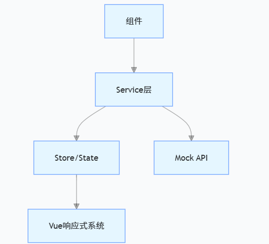

# 实验三 单一数据源实验⭐

## 架构设计思想

### 分层架构



## 数据准备 data

### 接口定义

? 表示可选属性

```ts
//Shops: 店铺信息
export interface Shops {
  id: string
  name: string
  phone: string
  img?: string // 店铺图片(可选)
  score: number // 评分
  deliveryFee?: number // 配送费(可选)
  items: Item[] // 商品列表
}

//Item: 商品信息
export interface Item {
  id: string
  name: string
  price: number
  img: string // 商品图片
  sales: number // 销量
}

//Order: 订单信息，关联店铺和商品
export interface Order {
  shopId: string // 关联的店铺ID
  shopName: string // 店铺名称
  deliveryFee: number // 配送费
  items: {
    // 订单商品项
    item: Item // 商品详情
    quantity: number // 购买数量
  }[]
}
```

关于订单接口Order

```ts
//Order: 订单信息，关联店铺和商品
export interface Order {
  shopId: string // 关联的店铺ID
  shopName: string // 店铺名称
  deliveryFee: number // 配送费
  items: {
    // 订单商品项
    item: Item // 商品详情
    quantity: number // 购买数量
  }[]
}
```

items: { item: Item; quantity: number }[]

items 是一个数组，数组中的每个元素都是 { item: Item; quantity: number } 这种结构的对象

### 模拟 API 函数

```ts
// 获取店铺列表模拟数据
export const listShopsMock = async (): Promise<Shops[]> => {
  return new Promise(resolve => {
    setTimeout(() => resolve(shops), 1000) // 模拟1秒延迟
  })
}

// 获取单个店铺详情模拟数据
export const getShopMock = async (id: string): Promise<Shops | undefined> => {
  return new Promise(resolve => {
    setTimeout(() => resolve(shops.find(shop => shop.id === id)), 1000)
  })
}

// 获取店铺商品列表模拟数据
export const getShopItemsMock = async (shopId: string): Promise<Item[]> => {
  return new Promise(resolve => {
    setTimeout(() => {
      const shop = shops.find(s => s.id === shopId)
      resolve(shop?.items || [])
    }, 800)
  })
}

// 创建订单模拟数据
export const createOrderMock = async (order: Order): Promise<Order> => {
  return new Promise(resolve => {
    setTimeout(() => resolve(order), 500)
  })
}
```

#### 模拟真实的后端API

1. 都返回Promise，模拟异步请求
2. 使用setTimeout模拟网络延迟
3. 从内存中的shops数组获取数据

**​前端模拟API请求**

#### 如何编写这样的模拟请求函数：

基本结构解析

```ts
export const listShopsMock = async (): Promise<Shops[]> => {
  return new Promise(resolve => {
    setTimeout(() => resolve(shops), 1000)
  })
}
```

1. async​​：声明这是一个异步函数
   ​2. ​: Promise<Shops[]>​​：指定返回值的类型是Shops数组的Promise
   ​3. ​new Promise​​：创建一个Promise对象
   ​4. ​setTimeout​​：模拟网络延迟（1秒）
   ​5. ​resolve(shops)​​：延迟结束后返回shops数据

**模拟真实网络请求的三个特征**

1. 异步性:使用Promise
2. 网络延迟:使用setTimeout
3. 类型一致性:Promise<Shops[]>类型声明

#### 分步编写指南

步骤1：定义函数签名

```ts
// 明确输入输出类型
export const listShopsMock = async (): Promise<Shops[]> => {
  // 实现...
}
```

| 部分                 | 说明                                                | 必要性 |
| -------------------- | --------------------------------------------------- | ------ |
| export               | 导出函数，允许其他文件导入使用                      | 可选   |
| const                | 声明常量函数（推荐箭头函数用const）                 | 推荐   |
| listShopsMock        | 函数名称（遵循动词+名词的命名约定）                 | 必须   |
| async                | 标记为异步函数                                      | 必须   |
| (): Promise<Shops[]> | 类型注解：无参数，返回Promise且resolve值为Shops数组 | 强推荐 |
| => {}                | 箭头函数语法                                        | 必须   |

关于`async` 关键字

**async 关键字的作用：**

​1. ​自动包装返回值​​：非Promise返回值会自动被包装成Promise

```ts
// 等效于：
function syncVersion() {
  return Promise.resolve(shops)
}
```

​2. ​允许使用await​​：函数内可以使用await语法
​3. ​类型提示​​：IDE和TypeScript会识别为异步函数

**Promise<Shops[]> 类型详解**

1. Promise<T>​​：表示一个异步操作，最终会返回T类型的结果
   ​2. ​Shops[]​​：表示Shops类型的数组（等同于Array<Shops>）

步骤2：创建Promise对象

[Promise](https://developer.mozilla.org/zh-CN/docs/Web/JavaScript/Reference/Global_Objects/Promise)

```ts
return new Promise((resolve, reject) => {
  // 成功时调用resolve()
  // 失败时调用reject()
})
```

步骤3：添加延迟逻辑

```ts
setTimeout(() => {
  resolve(shops) // 成功返回数据
}, 1000) // 1秒延迟
```

步骤4：错误处理（可选）

```ts
// 带错误处理的版本
export const listShopsMock = async (): Promise<Shops[]> => {
  return new Promise((resolve, reject) => {
    setTimeout(() => {
      try {
        if (!shops) throw new Error('数据加载失败')
        resolve(shops)
      } catch (err) {
        reject(err)
      }
    }, 1000)
  })
}
```

#### 在组件中调用

example03/components/ShopList.vue

```ts
import { listShopsService } from '../service'
```

## 状态管理 store

### 创建全局状态 createGlobalState

[VueUse-createGlobalState](https://vueuse.org/shared/createGlobalState/)

createGlobalState 是 VueUse 库的函数，主要用于在 Vue 应用中创建可跨组件、跨实例共享的全局状态，解决了 Vue 组件间状态共享的问题。

```ts
export const useStore = createGlobalState(() => {
  // 响应式数据
  const shopList = ref<Shops[]>([])
  const shopMap = ref<Map<string, Shops>>(new Map())
  const orders = ref<Order[]>([])

  // 计算属性
  const totalCost = computed(() => {
    /*...*/
  })

  // 操作方法
  const addOrder = (shop: Shops, item: Item) => {
    /*...*/
  }

  return {
    /* 暴露的成员 */
  }
})
```

例如：

```ts
import { createGlobalState } from '@vueuse/core'
import { ref, computed } from 'vue'

//createGlobalState() 创建全局共享状态
export const useStore = createGlobalState(() => {
  const shopList = ref<Shop[]>([])
  const orders = ref<Order[]>([])

  const totalPrice = computed(() =>
    orders.value.reduce((sum, order) => sum + order.item.price * order.quantity, 0)
  )

  return { shopList, orders, totalPrice }
})
```

使用状态

```ts
import { useStore } from './store'

const { shopList, orders } = useStore()

// 添加订单
function addOrder(item: Item) {
  const existing = orders.value.find(o => o.item.id === item.id)
  if (existing) {
    existing.quantity++
  } else {
    orders.value.push({ item, quantity: 1 })
  }
}
```

| 部分      | 类型         | 作用                   | 技术实现           |
| --------- | ------------ | ---------------------- | ------------------ |
| shopList  | Ref<Shops[]> | 存储所有店铺列表       | ref() + 类型注解   |
| shopMap   | Ref<Map>     | 店铺ID到详情的快速查找 | Map数据结构        |
| orders    | Ref<Order[]> | 当前用户的全部订单     | 嵌套ref结构        |
| totalCost | ComputedRef  | 自动计算的订单总价     | computed()         |
| 操作方法  | 函数         | 修改状态的唯一入口     | 闭包访问响应式数据 |

views/example03/store/index.ts

```ts
import { createGlobalState } from '@vueuse/core'
import { computed, ref } from 'vue'
import type { Item, Order, Shops } from '../data/dataSource'

export const useStore = createGlobalState(() => {
  // 店铺列表
  const shopList = ref<Shops[]>([])

  // 店铺详情
  //Map<string, Shops>​​：键值对集合，键是店铺ID(string)，值是完整的店铺对象(Shops)
  //new Map()​​：初始化一个空的 Map 实例
  const shopMap = ref<Map<string, Shops>>(new Map())

  // 订单列表
  const orders = ref<Order[]>([])

  // 总花费
  const totalCost = computed(() => {
    return orders.value.reduce((total, order) => {
      //遍历所有订单 (orders.value)
      // // 计算单个订单的商品总价
      const itemsCost = order.items.reduce(
        //计算每个订单的商品小计
        (sum, { item, quantity }) => sum + item.price * quantity,
        0
      )
      return total + itemsCost + order.deliveryFee //// 累加：商品总价 + 配送费
    }, 0)
  })

  // 添加订单项
  const addOrder = (shop: Shops, item: Item) => {
    let order = orders.value.find(o => o.shopId === shop.id)

    if (!order) {
      order = {
        shopId: shop.id,
        shopName: shop.name,
        deliveryFee: shop.deliveryFee || 0,
        items: []
      }
      orders.value.push(order)
    }

    const existingItem = order.items.find(i => i.item.id === item.id)
    if (existingItem) {
      existingItem.quantity++
    } else {
      order.items.push({ item, quantity: 1 })
    }
  }

  // 减少订单项
  const removeOrder = (shop: Shops, item: Item) => {
    const orderIndex = orders.value.findIndex(o => o.shopId === shop.id)

    if (orderIndex !== -1) {
      const order = orders.value[orderIndex]
      const itemIndex = order.items.findIndex(i => i.item.id === item.id)

      if (itemIndex !== -1) {
        if (order.items[itemIndex].quantity > 1) {
          order.items[itemIndex].quantity--
        } else {
          order.items.splice(itemIndex, 1)
          // 订单没有商品，移除整个订单
          if (order.items.length === 0) {
            orders.value.splice(orderIndex, 1)
          }
        }
      }
    }
  }

  // 获取商品在订单中的数量
  const getItemQuantity = (shopId: string, itemId: string) => {
    const order = orders.value.find(o => o.shopId === shopId)
    if (!order) return 0

    const item = order.items.find(i => i.item.id === itemId)
    return item ? item.quantity : 0
  }

  return {
    shopList,
    shopMap,
    orders,
    totalCost,
    addOrder,
    removeOrder,
    getItemQuantity
  }
})
```

**计算属性 computed**

[计算属性](https://cn.vuejs.org/guide/essentials/computed.html)

基础格式：

```ts
const 变量名 = computed(() => {
  return 数据源.reduce((累积值, 当前项) => {
    // 计算逻辑...
    return 新的累积值
  }, 初始值)
})
```

对应实例，计算总费用：

```ts
const totalCost = computed(() => {
  return orders.value.reduce((total, order) => {
    const itemsCost = order.items.reduce(
      (sum, { item, quantity }) => sum + item.price * quantity,
      0
    )
    return total + itemsCost + order.deliveryFee
  }, 0)
})
```

**Reduce 方法**

[Reduce 方法](https://developer.mozilla.org/zh-CN/docs/Web/JavaScript/Reference/Global_Objects/Array/Reduce)

基础格式：

```ts
数组.reduce((
  累积变量,
  当前元素,
  [可选参数...]
) => {
  // 缩进2个空格
  计算逻辑...
}, 初始值) // 初始值另起一行
```

嵌套 Reduce 规范

```ts
外层.reduce((外层累积, 外层当前) => {
  const 内层结果 = 内层数组.reduce((内层累积, 内层当前) => {
    return ... // 缩进4个空格
  }, 内层初始值)

  return 结合内外层结果 // 缩进2个空格
}, 外层初始值)
```

添加商品到订单

```ts
const addOrder = (shop: Shops, item: Item) => {
  //在当前所有订单中查找该店铺的订单
  //.find()：数组方法,返回第一个匹配项，找不到返回 undefined
  let order = orders.value.find(o => o.shopId === shop.id)

  //订单不存在时的处理
  if (!order) {
    order = {
      //创建新订单对象
      shopId: shop.id, //存储店铺ID
      shopName: shop.name,
      deliveryFee: shop.deliveryFee || 0, // 默认值处理,|| 0 确保无配送费时不会出错
      items: [] //初始化空商品列表
    }
    orders.value.push(order) //将新订单加入订单列表，push()触发Vue响应式更新
  }

  //处理商品项
  const existingItem = order.items.find(i => i.item.id === item.id)
  if (existingItem) {
    //商品已存在
    existingItem.quantity++ // 增量
  } else {
    //商品不存在
    order.items.push({ item, quantity: 1 }) // 新增
  }
}
```

函数功能描述

```ts
function addOrder(shop: Shops, item: Item) {
  // 1. 查找或创建店铺订单
  // 2. 查找商品是否已存在
  // 3. 存在则增加数量，不存在则新增
}
```

[push方法](https://developer.mozilla.org/zh-CN/docs/Web/JavaScript/Reference/Global_Objects/Array/push)
移除订单项

```ts
const removeOrder = (shop: Shops, item: Item) => {
  //查找订单索引
  //.findIndex()，返回第一个匹配元素的索引（找不到返回-1）
  const orderIndex = orders.value.findIndex(o => o.shopId === shop.id)

  if (orderIndex !== -1) {
    //只有找到订单才继续执行
    const order = orders.value[orderIndex]
    //order.items	当前订单的商品列表
    const itemIndex = order.items.findIndex(i => i.item.id === item.id) //

    //查找商品索引
    if (itemIndex !== -1) {
      //商品存在性判断
      if (order.items[itemIndex].quantity > 1) {
        order.items[itemIndex].quantity--
      } else {
        order.items.splice(itemIndex, 1)
        // 订单没有商品，移除整个订单
        if (order.items.length === 0) {
          orders.value.splice(orderIndex, 1)
          //splice()，从数组中移除指定索引的元素
        }
      }
    }
  }
}
```

[splice方法](https://developer.mozilla.org/zh-CN/docs/Web/JavaScript/Reference/Global_Objects/Array/splice)

函数功能描述

```ts
function removeOrder(shop: Shops, item: Item) {
  // 1. 查找店铺订单位置
  // 2. 查找商品项位置
  // 3. 判断商品数量：
  //    - >1：减少数量
  //    - =1：移除商品项
  //    - 若商品项为空：移除整个订单
}
```

1. 商品数量 > 1​​（比如拿了3瓶可乐）：

你放回1瓶到货架 → 购物车里还剩2瓶（数量减少）

​​2.商品数量 = 1​​（只剩1瓶可乐）：

再放回这瓶 → 购物车里就没有可乐了（完全移除）

获取指定商品在当前订单中的数量(订单详情/购物车)

```ts
const getItemQuantity = (shopId: string, itemId: string) => {
  const order = orders.value.find(o => o.shopId === shopId) //查找店铺订单
  if (!order) return 0 //订单不存在判断,店铺订单不存在 = 商品数量为0

  const item = order.items.find(i => i.item.id === itemId)
  return item ? item.quantity : 0 //找到商品 → 返回其数量（item.quantity）;未找到 → 返回0
}
```

[fing方法](https://developer.mozilla.org/zh-CN/docs/Web/JavaScript/Reference/Global_Objects/Array/find)
函数核心功能

```ts
// 函数签名
function getItemQuantity(shopId: string, itemId: string): number
```

1. 输入​​：店铺ID + 商品ID

​​2. 输出​​：该商品在订单中的当前数量（找不到返回0）

## 服务层 service

src/views/example03/service/index.ts

```ts
import type { Item, Shops } from '../data/dataSource'
import { getShopMock, listShopsMock } from '../data/dataSource'
import { useStore } from '../store'

export const listShopsService = async (): Promise<Shops[]> => {
  const { shopList } = useStore()
  if (shopList.value.length === 0) {
    const mockData = await listShopsMock()
    shopList.value = mockData || [] // 确保总是返回数组
  }
  return [...shopList.value] // 返回新数组
}

export const getShopService = async (sid: string): Promise<Shops | null> => {
  const { shopMap } = useStore()
  let shop = shopMap.value.get(sid)
  if (shop) return shop

  // 异步加载数据，并更新store
  shop = await getShopMock(sid)
  if (shop) {
    shopMap.value.set(sid, shop)
    return shop
  }
  return null
}

export const getOrdersService = () => {
  return useStore().orders
}

export const addOrderService = (shop: Shops, item: Item) => {
  return useStore().addOrder(shop, item)
}

export const removeOrderService = (shop: Shops, item: Item) => {
  return useStore().removeOrder(shop, item)
}

export const getItemQuantityService = (shopId: string, itemId: string) => {
  return useStore().getItemQuantity(shopId, itemId)
}

export const getTotalCostService = () => {
  return useStore().totalCost
}
```

### 写法模板

```ts
export const get[数据名]Service = async (): Promise<数据类型[]> => {
  // 1. 获取缓存引用
  const { 缓存变量 } = useStore()

  // 2. 检查缓存有效性
  if (需要更新条件) {
    // 3. 异步获取数据
    const newData = await 数据获取函数()

    // 4. 安全更新缓存
    缓存变量.value = newData || 默认值
  }

  // 5. 返回副本
  return [...缓存变量.value]
}
```

```ts
export const listShopsService = async (): Promise<Shops[]> => {
  const { shopList } = useStore()
  if (shopList.value.length === 0) {
    const mockData = await listShopsMock()
    shopList.value = mockData || [] // 确保总是返回数组
  }
  return [...shopList.value] // 返回新数组
}
```

## 组件 components

> > > > > > > a734b822ba33006599fa8c56180cd00fa12b3d31
